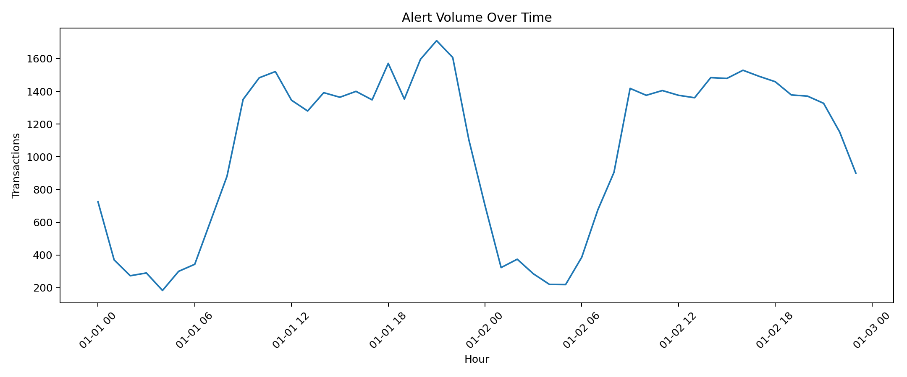

# Fraud / Anomaly Detection Operations Monitor

A portfolio-grade fraud monitoring project built for **risk operations, fintech, insurance, and transaction monitoring** use cases.

This project is intentionally designed as a **client-facing product demo**, not just a notebook. It combines:

- **Fraud detection** using supervised machine learning
- **Anomaly detection** using unsupervised scoring
- **Alert prioritization** for analyst triage
- **Business rules** for explainable review reasons
- **Investigation workflow** in a polished Streamlit command center
- **FastAPI scoring endpoint** for batch scoring workflows

---

## What makes this project strong for a portfolio?

Instead of stopping at "fraud vs non-fraud prediction", this project answers the question real operations teams care about:

> **Which alerts should be reviewed first, and why?**

The app surfaces:

- a ranked **alert queue**
- **critical / high / medium / low** priority bands
- transaction-level **risk summaries**
- a lightweight **analyst workbench**
- **governance metrics** for model monitoring

---

## Dataset strategy

The project uses a **real public credit-card fraud dataset** as the base signal source and then adds a carefully designed **operational context layer** for a more realistic monitoring experience.

### Important note

The original public dataset contains:
- `Time`
- `Amount`
- anonymized numerical transaction features `V1` to `V28`
- `Class` (fraud label)

To turn that into a better **operations-monitoring product demo**, the build pipeline enriches the records with realistic portfolio fields such as:

- `customer_id`
- `channel`
- `merchant_category`
- `device_risk_tier`
- `country` / `home_country`
- `account_age_days`
- `prior_chargeback_count`
- `amount_vs_profile`
- `minutes_since_prev_tx`

This lets the final product look and behave more like a real fraud operations console while still preserving the original fraud-learning signal.

---

## Included in this package

### App
- `app/streamlit_app.py`
- Executive overview
- Alert queue
- Investigation workbench
- Model governance page

### API
- `api/main.py`
- Health endpoint
- CSV scoring endpoint

### ML pipeline
- enrichment logic
- hybrid scoring model
- business rules layer
- anomaly scoring
- artifact saving/loading

### Demo assets
- `data/demo_scored_transactions.csv`
- `data/demo_input_template.csv`
- trained model artifacts
- static preview charts in `assets/`

---

## Model architecture

### 1) Supervised fraud model
An XGBoost classifier learns fraud probability from:
- original transaction signals
- operational context features
- behavior-derived features

### 2) Unsupervised anomaly layer
An Isolation Forest adds an anomaly perspective for unusual patterns that are not explained by the classifier alone.

### 3) Rules layer
Human-readable rules add immediate operational trust, for example:
- large amount vs baseline
- rapid repeat behavior
- new account + high-value transaction
- cross-border high-risk combinations
- chargeback history

### 4) Composite alert score
Final alert priority blends:
- fraud probability
- anomaly score
- transaction impact
- rule hit count

This is what powers the ranked alert queue.

---

## Current demo metrics

These metrics come from the packaged trained model artifacts:

- **ROC-AUC:** 0.997
- **PR-AUC:** 0.908
- **Decision threshold:** 0.844
- **Precision at selected threshold:** 1.000
- **Recall at selected threshold:** 0.787

Demo monitoring dataset:
- **50,000 scored transactions**
- **476 review-queue transactions**
- **157 critical alerts**

---

## Project structure

```text
fraud-ops-monitor/
├── api/
│   └── main.py
├── app/
│   └── streamlit_app.py
├── artifacts/
│   ├── feature_schema.json
│   ├── fraud_hybrid_model.joblib
│   ├── isolation_forest.joblib
│   ├── metrics.json
│   └── preprocessor.joblib
├── assets/
│   ├── alert_volume_over_time.png
│   ├── fraud_rate_by_alert_band.png
│   ├── hero_metrics.json
│   └── priority_band_distribution.png
├── data/
│   ├── demo_input_template.csv
│   └── demo_scored_transactions.csv
├── scripts/
│   ├── build_demo_assets.py
│   └── download_real_data.py
├── src/
│   ├── config.py
│   ├── data_prep.py
│   ├── inference.py
│   ├── modeling.py
│   └── rules.py
├── tests/
│   └── test_scoring.py
├── Dockerfile
├── README.md
├── requirements.txt
├── run_api.sh
└── run_app.sh
```

---

## How to run

### 1) Create environment and install dependencies

```bash
python -m venv .venv
source .venv/bin/activate   # macOS / Linux
.venv\Scripts\activate      # Windows
pip install -r requirements.txt
```

### 2) Launch the Streamlit app

```bash
streamlit run app/streamlit_app.py
```

### 3) Launch the API

```bash
uvicorn api.main:app --reload
```

---

## API usage

### Health check

```bash
GET /health
```

### Score an enriched CSV

```bash
POST /score
```

Upload a CSV that matches the schema in `data/demo_input_template.csv`.

---

## Rebuilding from the public raw dataset

If you want to regenerate the full demo pipeline locally:

```bash
python scripts/download_real_data.py
PYTHONPATH=. python scripts/build_demo_assets.py
```

This will:
- download the raw public credit-card fraud dataset
- enrich it with operational context
- retrain the hybrid model
- rebuild the scored demo dataset
- regenerate queue files and preview charts

---

## Portfolio positioning

This project is ideal when pitching work like:

- fraud detection systems
- anomaly detection dashboards
- transaction monitoring tools
- alert triage and risk operations products
- fintech ML dashboards
- explainable risk scoring systems

A strong one-line pitch for proposals:

> I build fraud and anomaly monitoring systems that combine machine learning, alert prioritization, investigation workflows, and explainable risk scoring for operations teams.

---

## Suggested deployment options

- **Streamlit Community Cloud** for a quick demo
- **Render / Railway** for the API
- **Docker-based deployment** for a cleaner production-style showcase

---

## Notes

- The packaged project is intentionally optimized for **portfolio demo quality** and **local usability**.
- It ships with ready-to-use demo data and trained artifacts so it can run immediately.
- A rebuild path is included for anyone who wants to regenerate everything from the public raw data.

## Preview assets
The repository already includes visual outputs that are ready to surface in GitHub:




## Optional tests
```bash
pip install -r requirements-dev.txt
pytest -q
```
